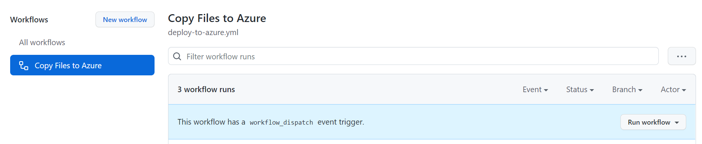
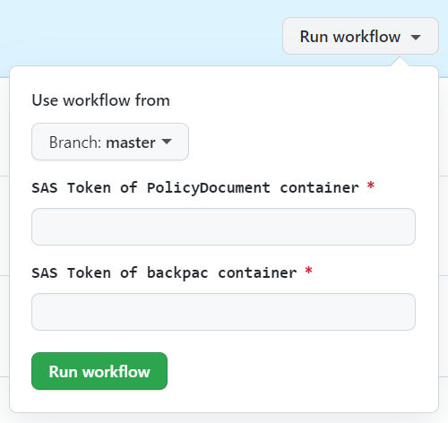

Network Hands-on lab  
February 2022

 

### 参考情報
- <a href="https://docs.microsoft.com/ja-jp/azure/cloud-adoption-framework/ready/azure-best-practices/resource-naming">名前付け規則を定義する</a>

- <a href="https://docs.microsoft.com/ja-jp/azure/cloud-adoption-framework/ready/azure-best-practices/resource-abbreviations">Azure リソースの種類に推奨される省略形</a>

 

## リソースの展開

 

### パラメーター

- **storageAccountName**: ストレージ アカウント名

- **sqlServerName**: SQL Server 名

- **sqlAdministratorLogin**: SQL 管理者

- **sqlAdministratorPassword**: SQL 管理者パスワード

- **webAppName**: Web App 名

- **logAnalyticsWorkspace**: LogAnalytics ワークスペース名

 

※事前にリソース グループの作成が必要

※選択したリソース グループのリージョンにすべてのリソースが展開

 

## リソースの設定

※ **GitHub Actoins を使用してファイルのコピー、Web アプリケーションの展開を行うためにリポジトリを自身の GitHub アカウントに Fork してください。**

- Blob ストレージ

  - コンテナの作成

    - Web アプリケーションで使用する PDF ファイルの保存コンテナ
    
      名前： **policydocuments**　パブリック アクセス レベル： **BLOB (BLOB 専用の匿名読み取りアクセス)**

    - SQL Database の復元に使用する .bacpac ファイルの保存コンテナ
    
      名前： **bacpac**　パブリック アクセス レベル： **プライベート (匿名アクセスはありません)**

  - 作成した２つのコンテナの SAS トークンの作成

    - **共有アクセス トークン** メニューを選択

    - **アクセス許可** から **読み取り**, **追加**, **作成**, **書き込み**, **削除**, **リスト** を選択

      

    - **SAS トークンおよび URL を生成** をクリック

    - **BLOB SAS URL** をコピー

      

  - コンテンツのコピー

- GitHub リポジトリからファイルをコピー

  - <a href="../../actions">GitHub Actions</a> へ移動

  - **** を選択し **Run workflow** をクリック

    
  
  - コピーしたコンテナの BLOB SAS URL をパラメーターへ貼り付け

    

    - **SAS Token of PolicyDocument container**: policydocuments コンテーの BLOB SAS URL

    - **SAS Token of backpac container**: bacpac コンテナーの BLOB SAS URL

  - **Run workflow** をクリックして、ワークフローを実行

- SQL Database の作成

  - **概要** ページの **データベースのインポート** をクリック

    
  
  - バックアップ ファイルを選択し、データベースを構成

    - **バックアップの選択**: 先の手順でコピーした backpac ファイルを選択

    - **価格レベル**: 任意（サーバーレス、Gen5、1 vCore など低価格なもの）

    - **データベース名**: ContosoInsurane

    - **照合順序**: SQL_Latin1_General_CP1_CI_AS

    - **認証の種類**: SQL Server

    - **サーバー管理者ログイン**、**パスワード**: リソース作成時に指定したものを入力

      
  
  - **OK** をクリックし、データベースの復元を実行

- Web アプリケーションの展開

  - WebApps の **概要** ページで **発行プロファイルの取得** をクリック

  - ダウンロードしたファイルを保存

  - GitHub リポジトリの **Settings** を表示、**Actions secrets** へ新しいシークレットを作成

    - シークレット名: **AZURE_WEBAPP_PUBLISH_PROFILE**

    - 値: ダウンロードした発行プロファイルの内容を貼り付け

      
  
  - GitHub Actions のワークフローを実行し、アプリケーションを展開

    - **Run workflow** をクリックし、展開先の Web Apps の名前をパラメータへ入力

    - **Run workflow** をクリック

- Web アプリケーションの構成

  - WebApps の **構成** ページで、以下４つのアプリケーション設定を追加

    - 名前: **StorageAccountName** / 値: ストレージ アカウント名

    - 名前: **ContainerName** / 値: **policydocuments**  (PDF ファイルを保存したコンテナ名)

    - 名前: **BlobConnectionString** / 値: ストレージ アカウントへの接続文字列

    - 名前: **SqlConnectionString** / 値: ContosoInsurane データベースへの接続文字列
  
  - **保存** をクリックし、アプリケーションを再起動
