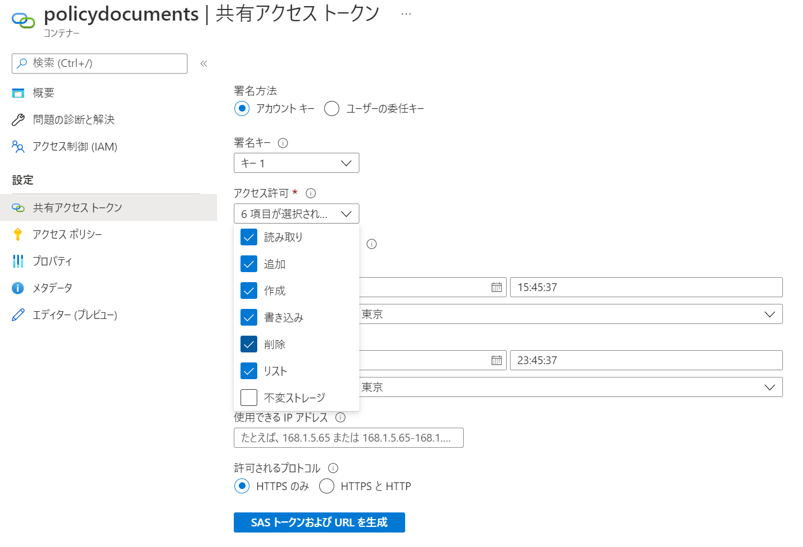
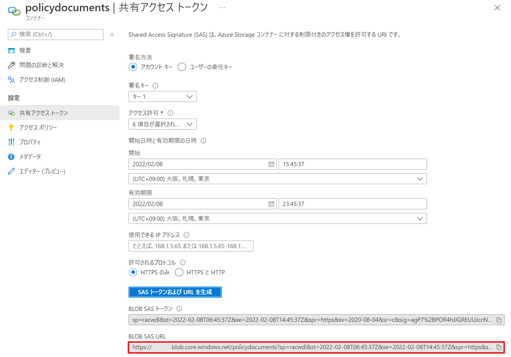
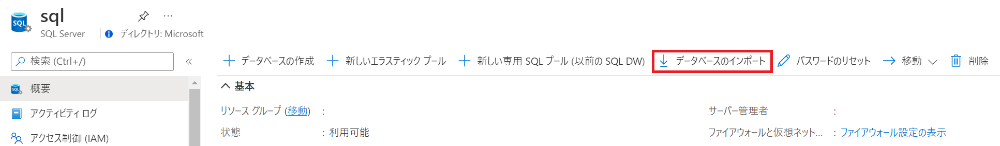
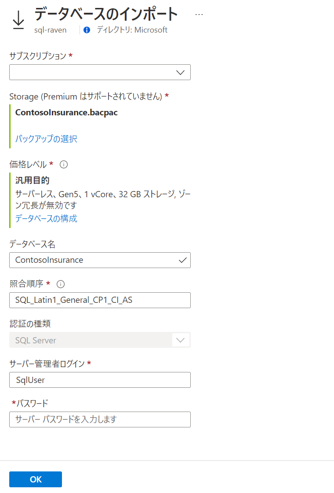

Network Hands-on lab  
February 2022

 

### 参考情報
- <a href="https://docs.microsoft.com/ja-jp/azure/cloud-adoption-framework/ready/azure-best-practices/resource-naming">名前付け規則を定義する</a>

- <a href="https://docs.microsoft.com/ja-jp/azure/cloud-adoption-framework/ready/azure-best-practices/resource-abbreviations">Azure リソースの種類に推奨される省略形</a>

 

## リソースの展開

 

### パラメーター

- **storageAccountName**: ストレージ アカウント名

- **sqlServerName**: SQL Server 名

- **sqlAdministratorLogin**: SQL 管理者

- **sqlAdministratorPassword**: SQL 管理者パスワード

- **webAppName**: Web App 名

- **logAnalyticsWorkspace**: LogAnalytics ワークスペース名

 

※事前にリソース グループの作成が必要

※選択したリソース グループのリージョンにすべてのリソースが展開

## リソースの設定

- Blob ストレージ

  - コンテナの作成

    - 名前： **policydocuments**　パブリック アクセス レベル： **BLOB (BLOB 専用の匿名読み取りアクセス)**

    - 名前： **bacpac**　パブリック アクセス レベル： **プライベート (匿名アクセスはありません)**

  - 作成した２つのコンテナの SAS トークンの作成

    - **共有アクセス トークン** メニューを選択

    - **アクセス許可** から **読み取り**, **追加**, **作成**, **書き込み**, **削除**, **リスト** を選択

      

    - **SAS トークンおよび URL を生成** をクリック

    - **BLOB SAS URL** をコピー

      

  - コンテンツのコピー

- GitHub リポジトリからファイルをコピー

  - <a href="./actions">ワークフロー</a> へ移動

  - コピーしたコンテナの BLOB SAS URL をパラメーターへ貼り付け

    

    - **SAS Token of PolicyDocument container**: policydocuments コンテーの BLOB SAS URL

    - **SAS Token of backpac container**: bacpac コンテナーの BLOB SAS URL

  - **Run workflow** をクリックして、ワークフローを実行

- SQL Database の作成

  - **概要** タブの **データベースのインポート** をクリック

    
  
  - バックアップ ファイルを選択し、データベースを構成

    - **バックアップの選択**: 先の手順でコピーした backpac ファイルを選択

    - **価格レベル**: 任意（サーバーレス、Gen5、1 vCore など低価格なもの）

    - **データベース名**: ContosoInsurane

    - **照合順序**: SQL_Latin1_General_CP1_CI_AS

    - **認証の種類**: SQL Server

    - **サーバー管理者ログイン**、**パスワード**: リソース作成時に指定したものを入力

    
  
  - **OK** をクリックし、データベースの復元を実行

- Web アプリケーションの展開
