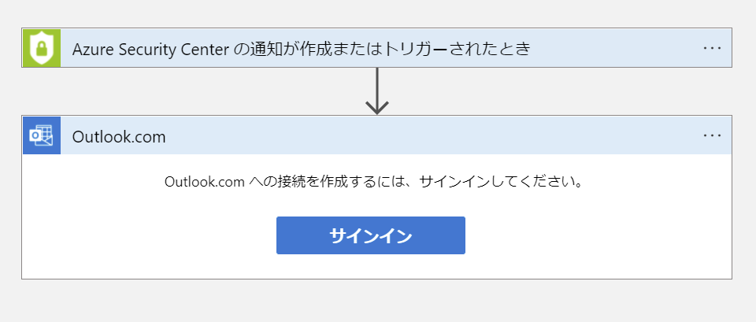
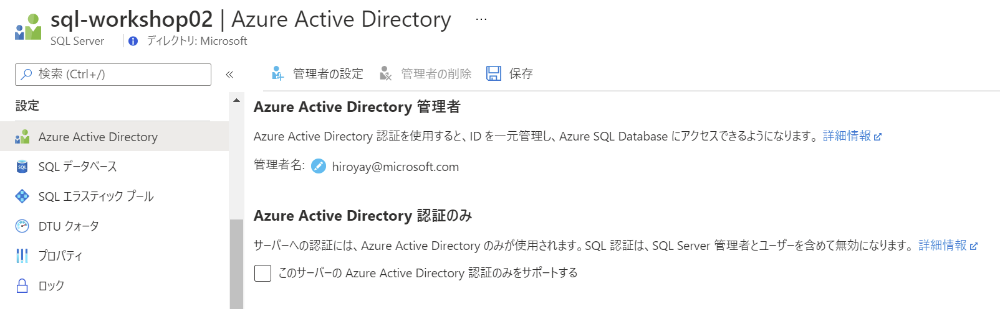

Network Hands-on lab  
February 2022

<br />

**Contents**

- [Appendix 1: Microsoft Defender for Cloud のアラート通知](#appendix-1-microsoft-defender-for-cloud-のアラート通知)

- [Appendix 2: マネージド ID の使用](#appendix-2-マネージド-id-の使用)

  - [Task 1: マネージド ID の有効化](#task-1-マネージド-id-の有効化)

  - [Task 2: ストレージ アカウントへのアクセス許可](#task-2-ストレージ-アカウントへのアクセス許可)

  - [Task 3: Azure Active Directory ユーザーを SQL サーバーの管理者へ割り当て](#task-3-azure-active-directory-ユーザーを-sql-サーバーの管理者へ割り当て)
  
  - [Task 4: マネージド ID へアクセス許可を付与](#task-4-マネージド-id-へアクセス許可を付与)

  - [Task 5: アプリケーション構成の変更](#task-5-アプリケーション構成の変更)

  - [Task 6: アプリケーションの動作確認](#task-6-アプリケーションの動作確認)

<br />

## Appendix 1: Microsoft Defender for Cloud のアラート通知


<br />

- Azure Portal のトップ画面から **ツール** に表示される **Microsoft Defender for Cloud** をクリック

  

- **ワークフローの自動化** を選択し **＋ ワークフローの自動化の追加** をクリック

  

- **名前** を入力し、**サブスクリプション**、**リソース グループ**、**トリガー条件** を選択

  - トリガーの条件

    - **Defender for Cloud のデータ型**： セキュリティ アラート

    - **アラートの重要度**： すべて選択

  操作の **Logic Apps ページにアクセスします** をクリック

  

- 新しいタブでロジック アプリの画面が表示、**＋ 追加** をクリック

  

- ロジック アプリの作成

  - **基本** タブ

    - **サブスクリプション**： ワークショップで使用中のサブスクリプションを選択

    - **リソース グループ**： ワークショップで使用中のリソース グループを選択

    - **ロジック アプリ名**： 任意（2文字以上、英数字、ハイフンを使用し一意となるよう入力）

    - **地域**： 展開先の地域を指定

    - **プラン**： **消費**

      ※プラン変更時に選択した地域がリセットされる場合があるので注意

    

  - **確認および作成** をクリックし、設定内容に問題がなければ作成をクリック

  - ロジック アプリのデプロイが完了したことを確認し **リソースに移動** をクリック

    

  - **ロジック アプリ デザイナー** が開くので **Blank Logic App** テンプレートを選択

    

  - デザイナーに空のワークフロー サーフェイスが表示

    

  - 検索ボックスに **Defender** と入力し、**Triggers** の **トリガー - 新しい WDATP アラートが発生したときにトリガー** を選択 

    

  - **Sign in** をクリック

    

    ※別ウィンドウで認証を求められるため、ワークショップで使用している資格情報を使用して認証処

    ※アクセス許可を求めるメッセージが奉持される場合は許諾

  - **+ New step** をクリック

    

  - 検索ボックスに **Outlook** と入力し、表示される候補から **Outlook.com** を選択

    

  - **メールの送信 (V2)** を選択

    

  - **Sign in** をクリック

    

    ※別ウィンドウで認証を求められるため、ワークショップで使用している資格情報を入力

    ※アクセス許可を求めるメッセージが表示される場合は許諾

- メール送信に必要な情報を設定

    - **宛先**： 任意

    - **件名**： Security Alert: アラートID（アラート ID は Dynamic content から選択）

    - **本文**： アラート ID と Body を Dynamic content から選択

    

    

- **保存** をクリックし、ワークフローの作成を終了

    

- ワークフローの自動化を設定中のタブに切り替え

  **最新の情報に更新** をクリック、**ロジック アプリ名** にリストから作成したロジック アプリを選択

  

- 完了

  

<br />

## Appendix 2: マネージド ID の使用


<br />

### Task 1: マネージド ID の有効化

- App Service の管理ブレードへ移動し、**ID** を選択

- **システム割り当て済み** タブで **状態** を **オン** に設定し保存

  

- メッセージが表示されるので **はい** をクリック

- マネージド ID の構成が完了

  

<br />

### Task 2: ストレージ アカウントへのアクセス許可

- ストレージ アカウントの管理ブレードへ移動し **アクセス制御 (IAM)** を選択

- **追加** - **ロール割り当ての追加** を選択

  

- **ストレージ BLOB データ共同作成者** を選択し **次へ** をクリック

  

- **メンバーの追加** をクリック

  

- App Service 名を入力し表示されるアカウントを選択し **選択** をクリック

  

- メンバーに App Service 名のアカウントが追加されたことを確認し **レビューと割り当て** をクリック

  

- **レビューと割り当て** をクリックし、ロールへアカウントを追加

- アプリケーションからは Azure Blob Storage クライアント ライブラリ v12 を使用しストレージへマネージド ID を使用し接続

  ```cs
  containerEndpoint = string.Format("https://{0}.blob.core.windows.net/{1}", accountName, containerName);

  BlobContainerClient containerClient = new BlobContainerClient(new Uri(containerEndpoint), new DefaultAzureCredential());
  ```

  ※ ソース コードには上記コードが追加済みのためアプリケーションの再展開は必要なし

  ※ [Web アプリから Azure Storage にアクセスする](https://docs.microsoft.com/ja-jp/azure/app-service/scenario-secure-app-access-storage?tabs=azure-portal%2Cprogramming-language-csharp)

<br />

### Task 3: Azure Active Directory ユーザーを SQL サーバーの管理者へ割り当て

- SQL Server の管理ブレードへ移動し **Azure Active Directory** を選択し **管理者の設定** をクリック

  

- Azure Active Directory から管理者とするユーザーを選択

  

  ※ ポータルへのサインインに使用しているユーザーを選択

- **保存** をクリック

  

<br />

### Task 4: マネージド ID へアクセス許可を付与

- SQL Server の管理ブレードへ移動し **ファイアウォールと仮想ネットワーク** を選択

- **＋ クライアント IP の追加** をクリック

  

- クライアント IP が規則に追加されたことを確認し **保存** をクリック

  

- ContosoInsurance データベースの管理ブレードへ移動

- **クエリ エディター (プレビュー)** を選択し、先の手順で設定した管理者で続行をクリック

  

- SQL プロンプトで次のコマンドを実行し、マネージド ID へアクセス許可を付与

  ```sql
  CREATE USER [your_app_service] FROM EXTERNAL PROVIDER;
  ALTER ROLE db_datareader ADD MEMBER [your_app_service];
  GO
  ```

  ※ your_app_service を App Service 名に変更

  

<br />

### Task 5: アプリケーション構成の変更

- App Service の管理ブレードへ移動し **構成** を選択

- **BlobConnectionString** をクリック

  

- **値** を空白にし **OK** をクリック

  

- **SqlConnectionString** をクリック

- **値** を以下の接続文字列へ変更

  ```
  Server=tcp:<your_sql_server>.database.windows.net,1433;Initial Catalog=ContosoInsurance;Authentication=Active Directory MSI;
  ```

  ※ <your_sql_server> を SQL Server 名へ変更

  

- **保存** をクリックし、表示されるメッセージで **続行** をクリック

- アプリケーションでは **Microsoft.Data.SqlClient** ライブラリ バージョン 2.1.0 以降を使用

  ※ [マネージド ID を使用してシークレットなしで App Service から SQL Database へ接続する](https://docs.microsoft.com/ja-jp/azure/app-service/tutorial-connect-msi-sql-database?tabs=windowsclient%2Cef%2Cdotnet)

  ※ [SqlClient での Azure Active Directory 認証の使用](https://docs.microsoft.com/ja-jp/sql/connect/ado-net/sql/azure-active-directory-authentication?view=sql-server-ver15)

### Task 6: アプリケーションの動作確認

- App Service の管理ブレードの **概要** タブから **URL** をクリック

- データベースからレコードを取得して表示できることを確認

- Blob ストレージへファイルのアップロードが正常に行えることを確認
