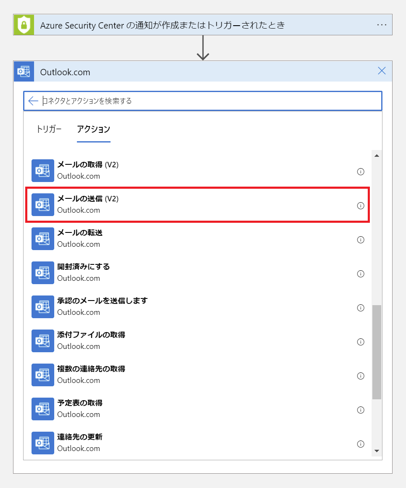
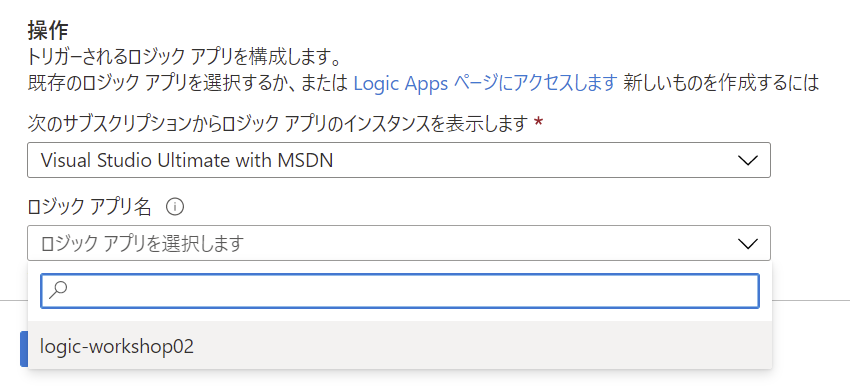
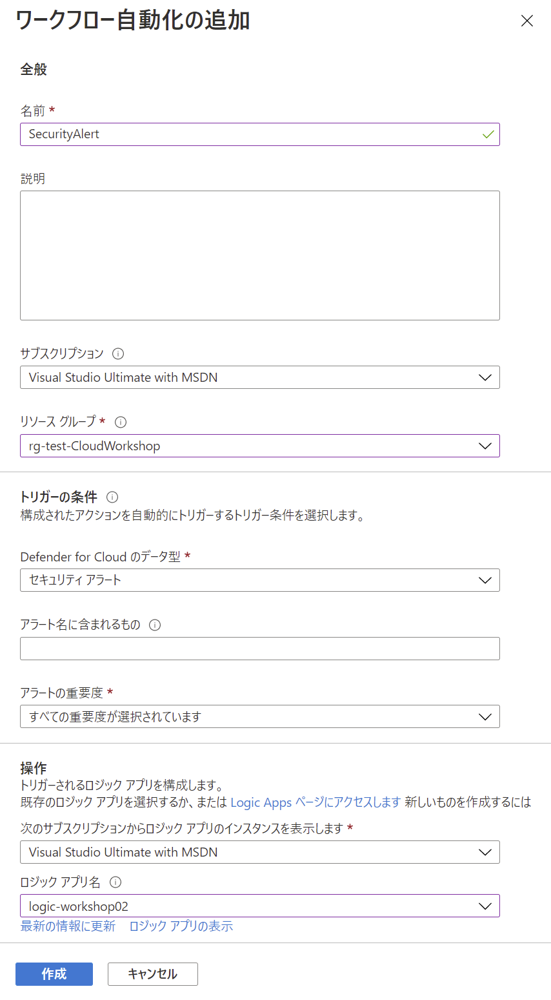

Network Hands-on lab  
February 2022

 

**Contents**

- [Appendix: 1 Microsoft Defender for Cloud のアラート通知](#appendix-1-microsoft-defender-for-cloud-のアラート通知)

- [Appendix: 2 マネージド ID を使用したストレージへのアクセス](#appendix-2-マネージド-id-を使用したストレージへのアクセス)

- [Appendix: 3 マネージド ID を使用した SQL Database へのアクセス](#appendix-3-マネージド-id-を使用した-sql-database-へのアクセス)

 

## Appendix: 1 Microsoft Defender for Cloud のアラート通知

- Azure Portal のトップ画面から **ツール** に表示される **Microsoft Defender for Cloud** をクリック

  

- **ワークフローの自動化** を選択し **＋ ワークフローの自動化の追加** をクリック

  

- **名前** を入力し、**サブスクリプション**、**リソース グループ**、**トリガー条件** を選択

  - トリガーの条件

    - **Defender for Cloud のデータ型**： セキュリティ アラート

    - **アラートの重要度**： すべて選択

  操作の **Logic Apps ページにアクセスします** をクリック

  

- 新しいタブでロジック アプリの画面が表示、**＋ 追加** をクリック

  

- ロジック アプリの作成

  - **基本** タブ

    - **サブスクリプション**： ワークショップで使用中のサブスクリプションを選択

    - **リソース グループ**： ワークショップで使用中のリソース グループを選択

    - **ロジック アプリ名**： 任意（2文字以上、英数字、ハイフンを使用し一意となるよう入力）

    - **地域**： 展開先の地域を指定

    - **プラン**： **消費**

      ※プラン変更時に選択した地域がリセットされる場合があるので注意

    

  - **確認および作成** をクリックし、設定内容に問題がなければ作成をクリック

  - ロジック アプリのデプロイが完了したことを確認し **リソースに移動** をクリック

    

  - **ロジック アプリ デザイナー** が開くので **Blank Logic App** テンプレートを選択

    

  - デザイナーに空のワークフロー サーフェイスが表示

    

  - 検索ボックスに **Defender** と入力し、**Triggers** の **トリガー - 新しい WDATP アラートが発生したときにトリガー** を選択 

    

  - **Sign in** をクリック

    

    ※別ウィンドウで認証を求められるため、ワークショップで使用している資格情報を使用して認証処

    ※アクセス許可を求めるメッセージが奉持される場合は許諾

  - **+ New step** をクリック

    

  - 検索ボックスに **Outlook** と入力し、表示される候補から **Outlook.com** を選択

    

  - **メールの送信 (V2)** を選択

    

  - **Sign in** をクリック

    

    ※別ウィンドウで認証を求められるため、ワークショップで使用している資格情報を入力

    ※アクセス許可を求めるメッセージが表示される場合は許諾

- メール送信に必要な情報を設定

    - **宛先**： 任意

    - **件名**： Security Alert: アラートID（アラート ID は Dynamic content から選択）

    - **本文**： アラート ID と Body を Dynamic content から選択

    

    

- **保存** をクリックし、ワークフローの作成を終了

    

- ワークフローの自動化を設定中のタブに切り替え

  **最新の情報に更新** をクリック、**ロジック アプリ名** にリストから作成したロジック アプリを選択

  

- 完了

  

 

## Appendix: 2 マネージド ID を使用したストレージへのアクセス

 

## Appendix: 3 マネージド ID を使用した SQL Database へのアクセス
